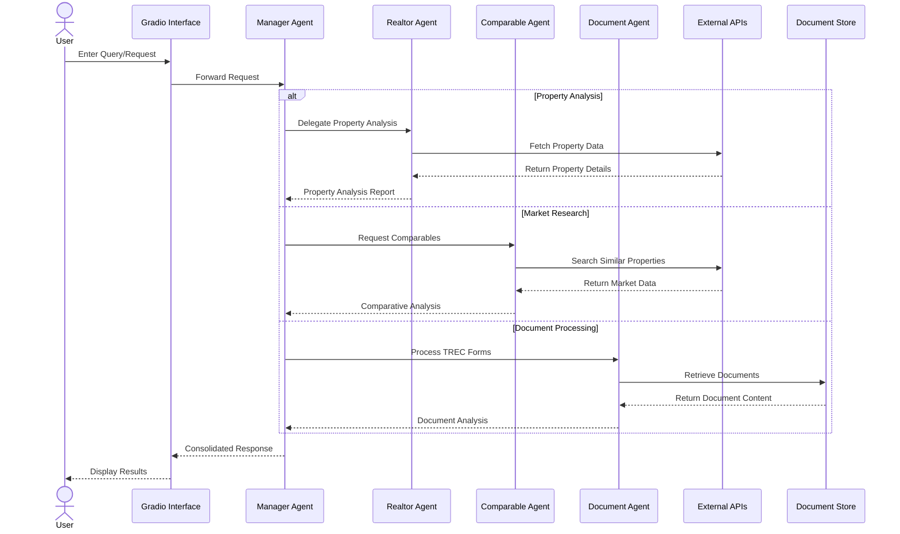

# Realtor Agent

An intelligent real estate agent system powered by AI that helps analyze properties, documents, and assists with real estate transactions and creating purchase sale agreements.

## Features

- Property Analysis from realtor.com
- Real Estate Document Processing
- Multi-Agent System Architecture
- Interactive Human-in-the-Loop Tools
- Document Search and Retrieval
- Live Property Data Scraping

## Demo


## System Flow



### Component Roles

1. **Manager Agent**
   - Coordinates between specialized agents
   - Handles user interaction flow
   - Determines request type and routing

2. **Realtor Agent**
   - Analyzes property listings
   - Generates property reports
   - Calculates key metrics

3. **Comparable Agent**
   - Performs market research
   - Finds similar properties
   - Analyzes neighborhood data

4. **Document Agent**
   - Processes TREC forms
   - Analyzes legal documents
   - Extracts key information

### Data Flow

1. User inputs query through Gradio interface
2. Manager Agent determines request type
3. Specialized agents process specific tasks
4. Results consolidated and returned to user
5. All interactions logged for tracking

## Prerequisites

- Python 3.8+
- Conda package manager
- Required API keys:
  - OPEN_API_KEY
  - ARIZE_SPACE_ID
  - ARIZE_API_KEY

## Installation

1. Create and activate a conda environment:
```bash
conda create --name <env>
conda activate <env>
```

2. Install dependencies:
```bash
pip install -r requirements.txt
```

3. Set environment variables:
```bash
export OPEN_API_KEY=<your_open_api_key> 
```

## Available Agents

1. **Realtor Agent**: Analyzes property data and generates detailed reports
2. **Comparable Agent**: Performs market research and property comparisons
3. **Document Agent**: Processes and analyzes real estate documents
   
## Usage

1. Run the demo:
```bash
python demo.py
```

2. Follow the prompts to interact with the real estate agent.

## Project Structure

- `demo.py`: Main script for the real estate agent system.
- `agents/`: Directory for agent components.
- `tools/`: Directory for tool components.
- `utils/`: Utility functions.
- `config.py`: Configuration settings.          

## Supported Document Types

- Multi-Family Purchase Agreements
- Residential Contracts
- Financing Documents
- Inspection Reports
- Title Documents
- And more...

## Support

For support, please open an issue in the repository or contact the maintainers.


## Hackathon

This project was created during Open Source AI Hackathon #14 - AI Agents https://lu.ma/0csh7daf

Saturday, February 22, 9:00 AM - 6:00 PM

Microsoft Reactor Redmond, Redmond, Washington

## Contributors

- [@Changsoo-Park](https://github.com/Changsoo-Park)
- [@mdeguzman827](https://github.com/mdeguzman827)
- [@nshantha](https://github.com/nshantha)
- [@tysonthomas9](https://github.com/tysonthomas9)
